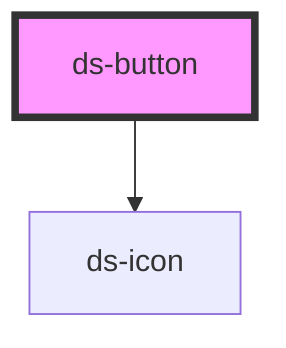

<!-- # ds-button -->

<!-- Auto Generated Below -->

## Properties

| Property          | Attribute          | Description                                          | Type                                     | Default     |
| ----------------- | ------------------ | ---------------------------------------------------- | ---------------------------------------- | ----------- |
| `ariaControls`    | `aria-controls`    | The aria-controls attribute for the button           | `string`                                 | `undefined` |
| `ariaDescribedby` | `aria-describedby` | The aria-describedby attribute for the button        | `string`                                 | `undefined` |
| `ariaExpanded`    | `aria-expanded`    | The aria-expanded attribute for the button           | `string`                                 | `undefined` |
| `ariaHaspopup`    | `aria-haspopup`    | The aria-haspopup attribute for the button           | `string`                                 | `undefined` |
| `ariaLabel`       | `aria-label`       | The aria-label attribute for the button              | `string`                                 | `undefined` |
| `ariaLabelledby`  | `aria-labelledby`  | The aria-labelledby attribute for the button         | `string`                                 | `undefined` |
| `ariaPressed`     | `aria-pressed`     | The aria-pressed attribute for the button            | `string`                                 | `undefined` |
| `autofocus`       | `autofocus`        | Whether the button is focused on page load           | `boolean`                                | `false`     |
| `color`           | `color`            | The variant of the button                            | `"primary" \| "secondary" \| "tertiary"` | `'primary'` |
| `disabled`        | `disabled`         | The button is disabled                               | `boolean`                                | `false`     |
| `fill`            | `fill`             | The fill of the button (background and border color) | `"clear" \| "outline" \| "solid"`        | `'solid'`   |
| `full`            | `full`             | The button takes up the full width of the container  | `boolean`                                | `false`     |
| `hasIcon`         | `has-icon`         | Whether the button has an icon                       | `boolean`                                | `false`     |
| `icon`            | `icon`             | The code of the button's icon (used with hasIcon)    | `string`                                 | `undefined` |
| `iconPosition`    | `icon-position`    | The position of the button's icon                    | `"left" \| "right"`                      | `'left'`    |
| `loading`         | `loading`          | Whether the button shows a loading icon              | `boolean`                                | `false`     |
| `size`            | `size`             | The size of the buton                                | `"lg" \| "md" \| "sm"`                   | `'md'`      |
| `type`            | `type`             | The type of the button                               | `"button" \| "link" \| "submit"`         | `'button'`  |
| `url`             | `url`              | The URL of the button (used with type link)          | `string`                                 | `undefined` |

## Events

| Event     | Description                         | Type                |
| --------- | ----------------------------------- | ------------------- |
| `dsBlur`  | Emitted when the button loses focus | `CustomEvent<void>` |
| `dsClick` | Emitted when the button is clicked  | `CustomEvent<void>` |
| `dsFocus` | Emitted when the button gains focus | `CustomEvent<void>` |

## Dependencies

### Depends on

- [ds-icon](../icon)

### Graph

----------------------------------------------

*Built with [StencilJS](https://stenciljs.com/)*
