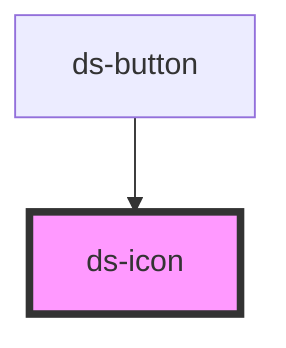

# ds-icon

<!-- Auto Generated Below -->

## Properties

| Property    | Attribute    | Description | Type                   | Default     |
| ----------- | ------------ | ----------- | ---------------------- | ----------- |
| `ariaLabel` | `aria-label` |             | `string`               | `undefined` |
| `color`     | `color`      |             | `string`               | `undefined` |
| `icon`      | `icon`       |             | `string`               | `undefined` |
| `size`      | `size`       |             | `"lg" \| "md" \| "sm"` | `'sm'`      |

## Dependencies

### Used by

 - [ds-button](../button)

### Graph

----------------------------------------------

*Built with [StencilJS](https://stenciljs.com/)*
