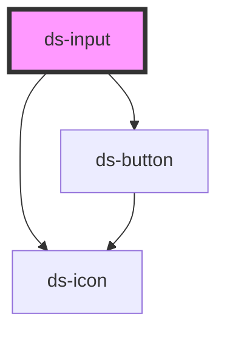

# ds-input

<!-- Auto Generated Below -->

## Properties

| Property        | Attribute        | Description                                                                              | Type                                                            | Default     |
| --------------- | ---------------- | ---------------------------------------------------------------------------------------- | --------------------------------------------------------------- | ----------- |
| `disabled`      | `disabled`       | If true, the user cannot interact with the input.                                        | `boolean`                                                       | `undefined` |
| `dsAriaLabel`   | `ds-aria-label`  | The aria-label attribute of the input                                                    | `string`                                                        | `undefined` |
| `eid`           | `eid`            | The id of the element                                                                    | `string`                                                        | `undefined` |
| `feedbackText`  | `feedback-text`  | Show the feedback message.                                                               | `string`                                                        | `undefined` |
| `feedbackType`  | `feedback-type`  | The type of the feedback                                                                 | `"error" \| "success"`                                          | `undefined` |
| `hasError`      | `has-error`      | Determinate when show the error.                                                         | `boolean`                                                       | `false`     |
| `hasIcon`       | `has-icon`       | Whether the input has an icon                                                            | `boolean`                                                       | `false`     |
| `helperMessage` | `helper-message` | Message to help the user fills the input value                                           | `string`                                                        | `undefined` |
| `icon`          | `icon`           | The code of the input's icon (used with hasIcon)                                         | `string`                                                        | `undefined` |
| `label`         | `label`          | Represents the caption of the input                                                      | `string`                                                        | `undefined` |
| `labelPosition` | `label-position` | Represents the position caption of the input                                             | `"inline" \| "stack"`                                           | `'inline'`  |
| `name`          | `name`           | The name of the input. Submitted with the form as part of a name/value pair              | `string`                                                        | `undefined` |
| `placeholder`   | `placeholder`    | Instructional text that shows before the input has a value.                              | `string`                                                        | `undefined` |
| `readonly`      | `readonly`       | If true, the user cannot modify the value.                                               | `boolean`                                                       | `false`     |
| `required`      | `required`       | If true, the user must fill in a value before submitting a form.                         | `boolean`                                                       | `undefined` |
| `size`          | `size`           | The size of the input                                                                    | `"lg" \| "md" \| "sm"`                                          | `'md'`      |
| `type`          | `type`           | The type of the input                                                                    | `"email" \| "password" \| "search" \| "tel" \| "text" \| "url"` | `'text'`    |
| `value`         | `value`          | Current value of the form control. Submitted with the form as part of a name/value pair. | `string`                                                        | `undefined` |

## Events

| Event      | Description                                                                                | Type                  |
| ---------- | ------------------------------------------------------------------------------------------ | --------------------- |
| `dsBlur`   | Emitted when the input loses focus                                                         | `CustomEvent<void>`   |
| `dsChange` | Emitted when the value has changed. This event doesn't fire until the control loses focus. | `CustomEvent<string>` |
| `dsClear`  | Emitted when the component is cleared                                                      | `CustomEvent<string>` |
| `dsFocus`  | Emitted when the input gains focus                                                         | `CustomEvent<void>`   |
| `dsInput`  | Emitted every time the value is updated by introducing a change                            | `CustomEvent<string>` |

## Dependencies

### Depends on

- [ds-icon](../icon)
- [ds-button](../button)

### Graph

----------------------------------------------

*Built with [StencilJS](https://stenciljs.com/)*
